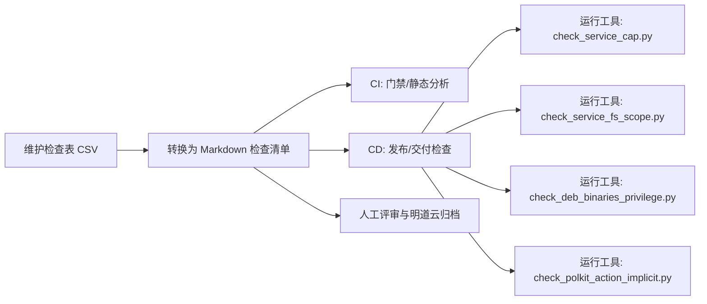
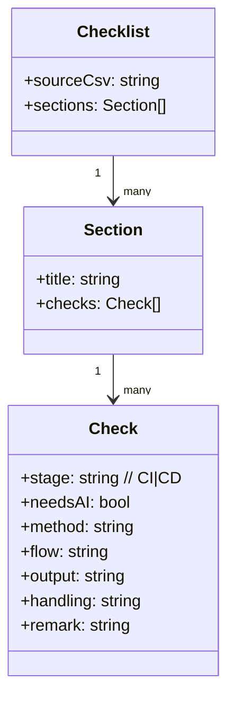

# 架构设计

## 目标

- 以 CSV 作为单一事实源维护 DBus 安全检查项。
- 产出可执行的 Markdown 检查清单，支撑 CI/CD 门禁与人工评审落地。
- 提供最小可用的自动化工具，降低关键检查项的人工成本与漏检风险。

## 产物与边界

- 输入：`DBus 安全检查-工作表1.csv`
- 输出：`DBus 安全检查-检查清单.md`
- 工具：`tools/check_service_cap.py`（支持单个/批量 service 检查；可对比期望 Cap）
- 工具：`tools/check_service_fs_scope.py`（输出 service 文件系统可读/可写范围摘要；检测 /var/lib /var/run /run 显式使用并给出 StateDirectory/RuntimeDirectory 提示）
- 工具：`tools/check_deb_binaries_privilege.py`（扫描已安装 deb 包内可执行文件，输出具有 capabilities 或 setuid/setgid 的二进制与所属包）
- 工具：`tools/check_polkit_action_implicit.py`（批量检查 actionid 的 implicit any/inactive/active，命中 yes/auth_self/auth_self_keep 时输出 actionid、所属包与配置）
- 过程性文档：`doc/changelog.md`、`.codex/plan/DBus安全检查清单转换.md`、`.codex/plan/systemd-service-cap检查工具.md`、`.codex/plan/systemd-service-cap工具增强.md`、`.codex/plan/systemd-service-fs-scope检查工具.md`、`.codex/plan/deb二进制cap与s位检查工具.md`、`.codex/plan/polkit-actionid隐式授权检查工具.md`

## 流程视图（UML/mermaid）

## 数据模型（UML/mermaid）

## 关键约定

- CSV 中“检查项”为空的行，视为上一条检查项的子检查条目。
- Markdown 中以 `- [ ]` 作为最小执行单元；字段缺失时不输出该字段，避免引入推断信息。
- 工具退出码：成功 `0`；service 不存在 `2`；Cap 与期望不一致 `3`；其他错误 `1`。
- 工具输入文件（`--services-file`/`--expected-caps`）按行读取，忽略空行与以 `#` 开头的注释行；支持 UTF-8 BOM，并会清理零宽字符以避免不可见字符污染。
- 文件系统范围工具输出基于 `ProtectSystem/ProtectHome/*Paths/StateDirectory/RuntimeDirectory` 等字段派生，建议与 unit 文件评审结合使用。
