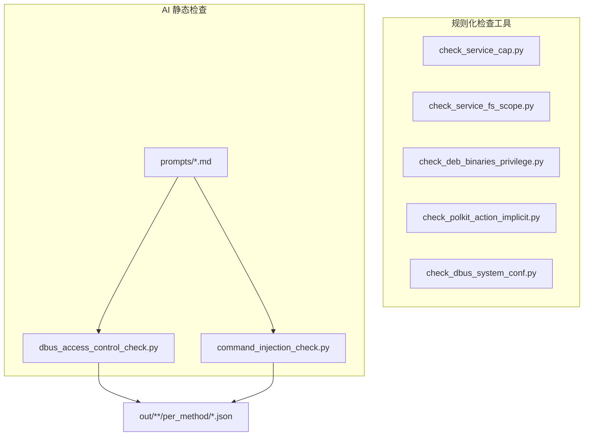

# 架构设计

## 目标

- 提供最小可用的自动化工具，降低关键检查项的人工成本与漏检风险。

## 产物与边界

- 工具：`tools/check_service_cap.py`（支持单个/批量 service 检查；可对比期望 Cap）
- 工具：`tools/check_service_fs_scope.py`（输出 service 文件系统可读/可写范围摘要；检测 /var/lib /var/run /run 显式使用并给出 StateDirectory/RuntimeDirectory 提示）
- 工具：`tools/check_deb_binaries_privilege.py`（扫描已安装 deb 包内可执行文件，输出具有 capabilities 或 setuid/setgid 的二进制与所属包）
- 工具：`tools/check_polkit_action_implicit.py`（批量检查 actionid 的 implicit any/inactive/active，命中 yes/auth_self/auth_self_keep 时输出 actionid、所属包与配置）
- 工具：`tools/check_dbus_system_conf.py`（扫描 DBus system.d 配置：1) default policy 下 allow own；2) root-own service methods 排除 default deny 后的残留方法集）
- 工具：`tools/dbus_access_control_check.py`（基于 Codex 的 DBus 方法访问控制检查，支持 JSON/JSONL 方法清单与逐条结果落盘）
- 工具：`tools/command_injection_check.py`（基于 Codex 的命令注入检查，按检查类型输出结构化结果与元数据）
- 内部复用模块：`tools/_common.py`（按行读文件、systemctl show、外部命令执行、错误分类等）
- 提示词模板：`prompts/*.md`（AI 检查的固定占位符模板）
- 过程性文档：`doc/changelog.md`、`.codex/plan/systemd-service-cap检查工具.md`、`.codex/plan/systemd-service-cap工具增强.md`、`.codex/plan/systemd-service-fs-scope检查工具.md`、`.codex/plan/deb二进制cap与s位检查工具.md`、`.codex/plan/polkit-actionid隐式授权检查工具.md`、`.codex/plan/dbus-systemd默认policy-own检查工具.md`、`.codex/plan/dbus-systemd检查工具-only-flagged.md`、`.codex/plan/dbus-systemd-root-service方法暴露检查工具.md`

## 总体结构（UML）

## AI 静态检查架构（摘要）

- 目标：提供可重复、可追溯的静态检查流程，并通过固定提示词与 JSON 校验降低幻觉风险。
- 组件：检查类型路由、提示词模板、方法清单解析、codex exec 执行、JSON 校验、结果落盘与汇总。
- 数据流：从方法清单/检查类型生成提示词，执行 codex 后校验 JSON 并落盘（详见 `doc/ai-check-architecture.md`）。

## 关键约定

- 工具退出码：成功 `0`；service 不存在 `2`；Cap 与期望不一致 `3`；其他错误 `1`。
- 工具输入文件（`--services-file`/`--expected-caps`）按行读取，忽略空行与以 `#` 开头的注释行；支持 UTF-8 BOM，并会清理零宽字符以避免不可见字符污染。
- 文件系统范围工具输出基于 `ProtectSystem/ProtectHome/*Paths/StateDirectory/RuntimeDirectory` 等字段派生，建议与 unit 文件评审结合使用。
